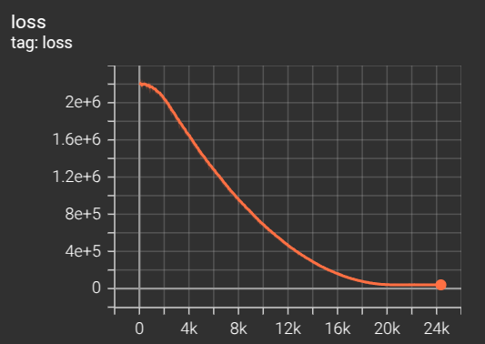
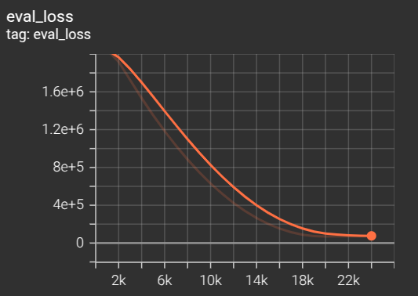

## Description

This repository is aimed at bridging the gap of leveraging object centric learning **from** *generic object classes in synthetic datasets* **to** *application specific, targeted detection (road users) in autonomous driving datasets*. Specifically, we primarily focus on enhancing the implementation transparency of leveraging these models to various real-world autonomous driving data based on the SAVi++ model which reports promising results for such real-world scaling of slot-based object centric learning for video (https://github.com/google-research/slot-attention-video/) [1]

## Pre-requisites for execution

- Create the environment for installing the required libraries and dependencies using the provided **requirements.yaml** file. 

- Depth-Anything-V2 model must be cloned (https://github.com/DepthAnything/Depth-Anything-V2) [2]

## Repository structure

We divide the repository into three workspaces, each of which provides implementations on creating a format-specific custom TFDS and corresponding SAVi++ architecture (including the dataloader) for training a model for emergent object segmentation of road users (vehicles, pedestrians, cyclists):
    - **waymo_ws**: Waymo Open Perception dataset [3]
    - **brno-we_ws**: BRNO Urban Dataset: Winter Extension [4]
    - **ADD_ws**: empty workspace with guidelines for adapting to a custom autonomous driving dataset of user preference 

Below is the complete organization of the current repository (including the model for monocular depth estimation):

## Execution

Refer to the workspace-specific README files

## Other notes

- TensorBoard can be used to visualize the progress of training for both datasets (e.g. `tensorboard --logdir=ckpt_waymo/`)  

  
  

## References:
1. Elsayed, G., Mahendran, A., Van Steenkiste, S., Greff, K., Mozer, M. C., & Kipf, T. (2022). Savi++: Towards end-to-end object-centric learning from real-world videos. *Advances in Neural Information Processing Systems, 35*, 28940–28954.

2. Yang, L., Kang, B., Huang, Z., Xu, X., Feng, J., & Zhao, H. (2024). Depth anything: Unleashing the power of large-scale unlabeled data. In *Proceedings of the IEEE/CVF Conference on Computer Vision and Pattern Recognition* (pp. 10371–10381).

3. Sun, P., Kretzschmar, H., Dotiwalla, X., Chouard, A., Patnaik, V., Tsui, P., Guo, J., Zhou, Y., Chai, Y., Caine, B., et al. (2020). Scalability in perception for autonomous driving: Waymo open dataset. In *Proceedings of the IEEE/CVF Conference on Computer Vision and Pattern Recognition* (pp. 2446–2454).

4. Ligocki, A., Jelinek, A., & Zalud, L. (2020). Brno urban dataset—the new data for self-driving agents and mapping tasks. In *2020 IEEE International Conference on Robotics and Automation (ICRA)* (pp. 3284–3290). IEEE.